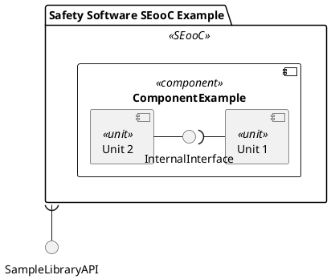
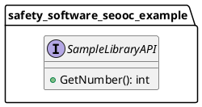
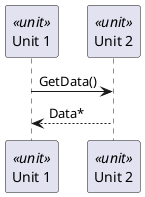

<!-- ----------------------------------------------------------------------------
  Copyright (c) 2026 Contributors to the Eclipse Foundation

  See the NOTICE file(s) distributed with this work for additional
  information regarding copyright ownership.

  This program and the accompanying materials are made available under the
  terms of the Apache License Version 2.0 which is available at
  https://www.apache.org/licenses/LICENSE-2.0

  SPDX-License-Identifier: Apache-2.0
----------------------------------------------------------------------------- -->

# PlantUML for rules_score

`rules_score` does not merely render your diagrams — it *parses* them into a typed model and
validates that model against your Bazel targets and your C++ implementation. Diagrams are
machine-readable source, not pictures. Everything below is enforced.

## Diagram kinds and where they attach

| Kind | Rule attribute | Template |
|------|----------------|----------|
| Structural component hierarchy | `architectural_design(static = [...])` | [templates/static_design.puml](templates/static_design.puml) |
| Sequence / interaction | `architectural_design(dynamic = [...])` | [templates/dynamic_design.puml](templates/dynamic_design.puml) |
| Externally visible interfaces | `architectural_design(public_api = [...])` | [templates/public_api.puml](templates/public_api.puml) |
| Interfaces between internal components | `architectural_design(internal_api = [...])` | [templates/internal_api.puml](templates/internal_api.puml) |
| Unit class diagram | `unit_design(static = [...])` | [templates/class_design.puml](templates/class_design.puml) |
| Fault tree | `fmea(root_causes = [...])` | [templates/fta.puml](templates/fta.puml) |

All of these attributes also accept `.plantuml`, `.svg`, `.rst` and `.md`.

## The two invariants

1. **Every element needs an explicit alias.** `as <alias>` is what the parser keys on, what
   relations reference, and what hyperlink injection targets. A diagram element without an alias
   is invisible to validation.
2. **Stereotypes are case-sensitive and closed.** Use exactly `<<SEooC>>`, `<<component>>`,
   `<<unit>>`, `<<interface>>`, `<<final>>`. A typo like `<<Component>>` silently produces an
   untyped element, which then fails the Bazel-vs-design consistency check with a confusing
   "missing in design" message.

## Structural diagram rules



- Exactly one `<<SEooC>>` package at the root; it is the dependable element boundary.
- `<<unit>>` is a leaf — it may not contain children.
- Nesting determines the fully qualified name: `safety_software_seooc_example.component_example.unit_1`.
  That FQN must match the Bazel target tree, and it is the id used for cross-diagram linking.
- Socket/lollipop notation expresses direction: `)-` provides the interface, `-(` requires it.
  Only `<<component>>` and `<<SEooC>>` elements may sit on the providing side of a binding —
  a `<<unit>>` cannot.

## Interface diagrams

Interfaces live in `namespace` blocks whose nesting mirrors the structural diagram:



Every interface referenced by the structural diagram must be declared in a `public_api` or
`internal_api` diagram, with matching FQN. Method signatures declared here are what sequence
diagram calls are checked against.

## Sequence diagrams



Participants must be units that exist in the structural diagram, and each call must name an
operation declared on the interface that connects them.

## Fault trees

FTA diagrams use procedures from the shipped metamodel; never draw the gates by hand:

```plantuml
@startuml
!include fta_metamodel.puml

$TopEvent("SampleFailureMode takes over the world", "SampleLibrary.SampleFailureMode")
$OrGate("OG1", "SampleLibrary.SampleFailureMode")
$IntermediateEvent("SampleFailureMode is Angry", "IEF", "OG1")
$BasicEvent("Just bad luck", "SampleLibrary.JustBadLuck", "OG1")
@enduml
```

Available procedures: `$TopEvent(name, alias)`, `$IntermediateEvent(name, alias, connection)`,
`$BasicEvent(name, alias, connection)`, `$AndGate(alias, connection)`, `$OrGate(alias, connection)`,
`$TransferInGate(alias, connection)`.

The aliases carry the traceability and must match TRLC records exactly:

- `$TopEvent` alias = `<Package>.<FailureModeRecordName>`
- `$BasicEvent` alias = `<Package>.<MeasureRecordName>`

Gate and intermediate aliases are diagram-local and free-form. `!include fta_metamodel.puml` is
resolved at Sphinx render time via the PlantUML include path — write it exactly like that, with
no directory prefix.

## `!include`

Supported: `!include`, `!include_once`, `!include_many`, `!includesub <path>!<label>`, with
relative or absolute local paths. **Not** supported: standard-library includes (`!include <aws/common>`)
and URL includes. Includes are expanded before parsing; cycles are a hard error.

## Debugging a parse or validation failure

1. Run the parser directly on the single file — see [reference/parser-cli.md](reference/parser-cli.md).
2. Missing element → check the alias exists and the stereotype is spelled exactly.
3. Interface mismatch → compare the FQN in the structural diagram against the `namespace`
   nesting in the API diagram.
4. Sequence call rejected → the operation is not declared on the connecting interface.

For diagrams that should be clickable in the rendered docs, read
[reference/clickable-pipeline.md](reference/clickable-pipeline.md).
